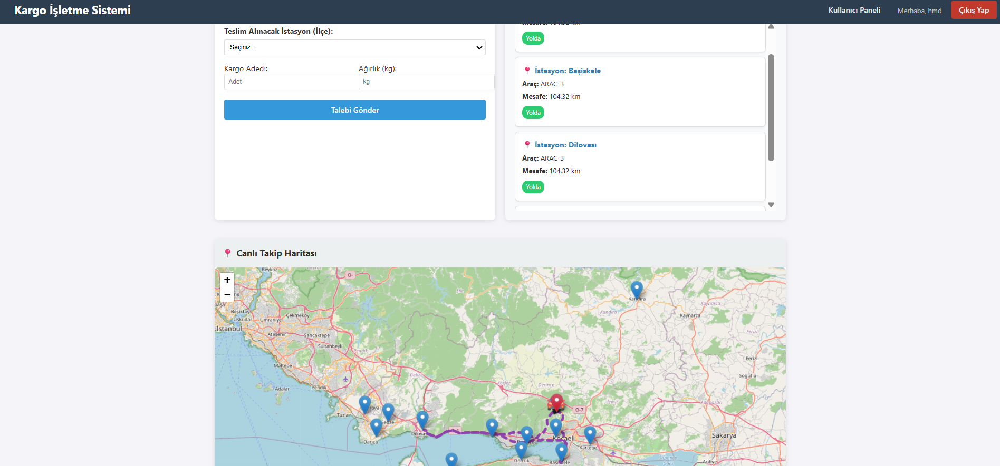
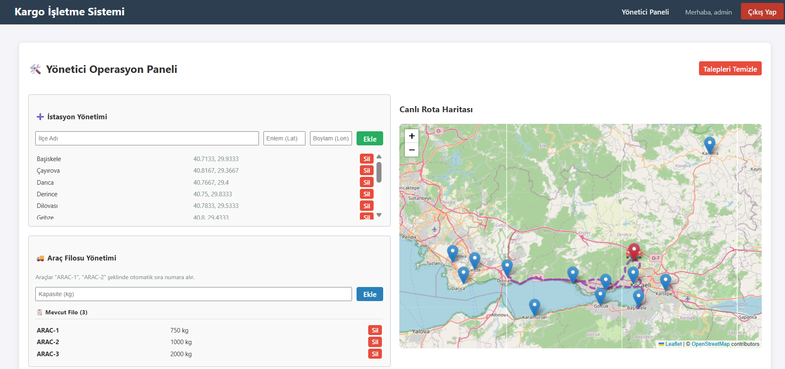
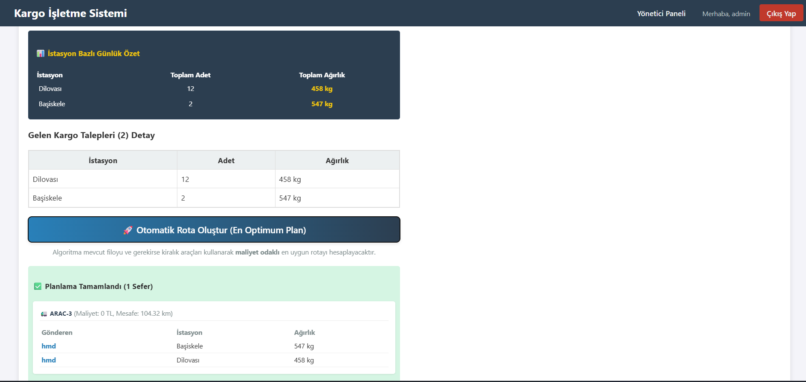

# Cargo Route Optimization System

## 📌 Overview
This project is a custom cargo route optimization system that calculates delivery routes using real-world path cost logic instead of simple straight-line distance.

It simulates realistic transportation by evaluating coordinate-based connections and minimizing route deviation.

---

## 🚀 Features
- Custom route optimization algorithm
- Real coordinate-based path cost calculation
- Dynamic route generation
- Backend-driven computation
- Map-based visualization

---

## 🏗️ Architecture

Frontend:
- React / Vue.js

Backend:
- Node.js / Python

Database:
- PostgreSQL / MySQL

Map:
- Leaflet / Mapbox (visualization only)

---

## ⚙️ Technologies
- JavaScript
- Node.js / Python
- SQL
- Map APIs

---

## 🔄 How It Works
1. Load delivery coordinates
2. Build graph structure
3. Calculate path costs
4. Generate optimized route

---

## 🚀 How to Run

```bash
# frontend
npm install
npm run dev

# backend
npm install
node server.js


## 📸 Proje Ekran Görüntüleri

<a href="images/images(user).png"></a>
<a href="images/images1(admin).png"></a>
<a href="images/images2(admin).png"></a>


